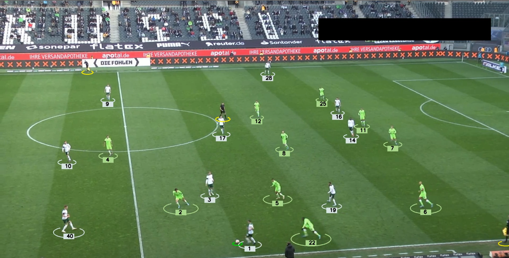
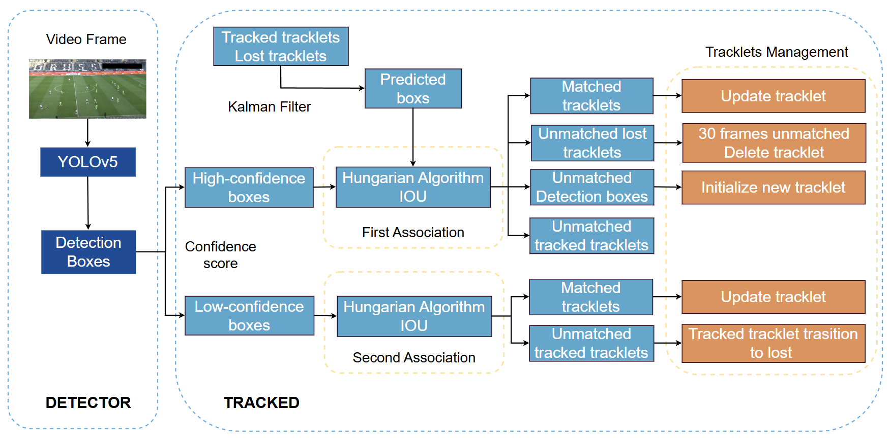

# Football Player Tracking using YOLOv8 + ByteTrack

## Introduction

This project detects and tracks football players using **YOLOv5** for detection and **ByteTrack** for multi-object tracking, then assigns each player into one of two teams based on jersey color clustering.  
A simple **Streamlit UI** is included for uploading videos and exporting processed results.


## Features

- Player Detection using YOLOv5
- Object Tracking using ByteTrack
- Implementation of a simplified ByteTrack algorithm (for educational understanding)
- Two-team jersey color classification
- Streamlit UI for uploading and processing videos
- Export processed video with bounding boxes, track IDs and team labels

```text
project/
├── main.py
├── yolo_inference.py
├── README.md
├── requirements.txt
├── input_videos/
├── output_videos/
├── models/
│   ├── best.pt
├── team_assigner/
│   └── two_team.py
├── track/
│   ├── byte_track.py
│   ├── kalman_filter.py
│   └── track.py
├── tracking/
│   └── tracker.py
└── training/
    └── training_yolov5.ipynb
```

## Explanation of the Pipeline



1. Detection
   YOLOv5 detects players frame-by-frame and outputs bounding boxes + confidence.
2. Tracking (ByteTrack)

- High-score detection → primary matching
- Low-score detection → secondary association
- Kalman Filter for motion prediction
- Hungarian algorithm for ID matching

3. Team Classification

- Extract dominant color inside bounding box
- k-Means clustering assigns player → Team A / B

## Trained Models

- [Trained YOLOv5](https://drive.google.com/file/d/10_XY1uhCLepBah7VszFqUGcluInDhQFx/view?usp=sharing)
  Place downloaded weights into models/ and adjust the path in configuration if needed.

## Input Video

- [Input Video Sample](https://drive.google.com/file/d/1-Ez4ednsFFScc2WLWt0sd9skWscCJIRx/view?usp=sharing)

## Installation

1. Clone the repository:

```bash
git clone https://github.com/yourname/project.git
cd project
```

2. Install dependencies:

```bash
pip install -r requirements.txt
```

3. Run the Streamlit app:

```bash
streamlit run main.py
```

## Requirements

- imageio==2.37.0
- numpy==2.3.5
- opencv_contrib_python==4.12.0.88
- opencv_python==4.12.0.88
- opencv_python_headless==4.10.0.84
- scikit_learn==1.7.2
- scipy==1.16.3
- streamlit==1.51.0
- ultralytics==8.3.217
